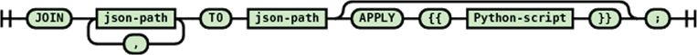

# Consumer Head

### Consumer Head

Consumer head coordinates a set of consumers. A consumer listens to a preconfigured message queue and applies a predefined operation to the document indicated by the received message and on success sets the processing status of the document to a preconfigured status. A class diagram showing the most important classes and interfaces for consumer head is shown below. The main class of the consumer head is `org.neuinfo.foundry.consumers.coordinator.ConsumerCoordinator` Each consumer implements `org.neuinfo.foundry.consumers.coordinator.IConsumer` interface. Ingestors are specific type of consumers. Each ingestor implements the interface `org.neuinfo.foundry.consumers.plugin.Ingestor`. At startup `ConsumerCoordinator` reads a consumer configuration file \(`consumers-cfg.xml`\) and using the `ConsumerFactory` singleton creates the corresponding consumers. There is also a generic `JavaPluginConsumer` that abstracts away common functionality of consumers including message processing and uses a plugin mechanism for the specific functionality. Most of the current consumers are implemented as plugins to this generic consumer. A consumer plugin implements `org.neuinfo.foundry.consumers.plugin.IPlugin` interface. Each consumer runs in its own thread \(`ConsumerWorker`\). Consumers must be stateless.

All ingestors are implemented as plugins to the `org.neuinfo.foundry.consumers.jms.consumers.GenericIngestionConsumer` class. The currently available ingestor plugins are located in the `org.neuinfo.foundry.consumers.jms.consumers.ingestors` package. The `Ingestor` interface has lifecycle methods to initialize parameters received in the message body to start the ingestion process. This include the harvest url and ingestion type specific parameters defined in the harvest description JSON file stored in the MongoDB under `sources` collection. The `startup()` method is generally used to get the data to an intermediate storage. An ingestor plugin acts like an iterator where `hasNext()` method returns true if there is still more records to process and `prepPayload()` method returns a JSON representation of the original record harvested. The `GenericIngestionConsumer` is responsible for duplicate checking, document wrapper generation.

