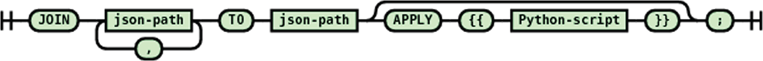

# Data Transform Language

### Data transformation language

Aggregation of heterogeneous semi-structured data from multiple sources requires alignment and transformation to a common format. To this end, we have developed a simple, curator friendly, transformation language to transform a given hierarchical data structure in JSON format to any desired JSON form including JSON-LD for linked data. The transformation language enables incremental development of data transformations since each transformation rule only handles a small number of branches (usually only one branch) in the source data hierarchy. Thus, the rules can be developed and tested individually.

With its embedded Python programming language execution capabilities, the introduced transformation language provides data manipulation capabilities of a full-blown computer language. The system includes a tool to automatically generate identity transformation rules from raw sample data as an aid to the curators to minimize effort. These features, together with the relative simplicity of the transformation language, lower the bar of entry for curators, decreasing data source transformation development and maintenance time. The transformation language was designed in concert with curators working on biomedical data curation for almost a decade in the FAIR Data Informatics Laboratory.

The first thing that needs to be addressed is how to indicate a path(s) in a JSON tree. For XML, there is the XPath specification to address this issue. However, there is no parallel standard for JSON. However, by analogy to the XPath specification there are attempts to implement/specify paths in a JSON tree. We have developed a subset of the analogous functionality to XPath as JSONPath based on the syntax from [https://goessner.net/articles/JsonPath](https://goessner.net/articles/JsonPath) to be used in the JSON transformation language (JSONTL). Our JSONPath implementation is tightly integrated with our transformation engine to allow complex nested multivalued source JSON forest to destination JSON forest transformations besides speed optimizations. The transformation language named JSONTL allows declaration of a mapping from a source path to a destination path optionally combining and/or transforming the source value. To support arbitrary value transformation, the JSONTL integrates the Python programming language. This way, common operations such as data cleanup, conversion, normalization, combining multiple fields, splitting values and generating calculated fields based on existing ones are made possible.

### **JSONPath syntax**

For the source side of a transformation statement, the JSONPath is used to match path(s) and for the destination side, the JSONPath is used to create a new path (branch in the JSON document tree). Due to this functionality difference, the recognized syntax of the source and destination JSONPaths are slightly different. The syntax diagrams for source document JSONPath syntax are shown in Figures 5and 6, the target document JSONPath syntax is shown in Figure 7.

.png>)

.png>)

.png>)

An example of JSONPath for a source document, taken from the transformation script for the PDB, is ‘$..'PDBx:database\_PDB\_revCategory'.'PDBx:database\_PDB\_rev'\[?(@.'@num' = '1')].'PDBx:date'.'\_$'’. This statement matches the text (‘$\\\_\\\$$’) of the PDBx:date object in the PDBx:database\_PDB\_rev object having a field named ‘@num’ (mapped from the ‘num’ XML attribute) with value equal to 1. The ‘$..’ at the beginning of the statement indicates that the remaining subtree is matched at an arbitrarily deep level in the source document JSON hierarchy.

An example of JSONPath for a destination document from the transformation script for PDB is ‘identifiers\[].ID’ where the destination document will have an array called ‘identifiers’ at the top level having objects with a field named ‘ID’.

#### **JSONTL syntax**

The transformation language consists of five types of statements allowing one-to-one, one-to-many, many-to-one and many-to-many mappings of various sorts. Besides the join statement, all JSONTL statements can be conditioned based on value, existence and non-existence of any source document field, using the optional conditional expression.

#### **Constant field generation**

This statement (see Figure 8) allows introducing fields with constant values that does not exist in the source record. This statement is mostly used to add metadata about the data source to processed records.

.png>)

An example constant field statement from the PDB transformation script is let "dataRepository.name" = "Protein Data Bank";

This statement assigns the value ‘Protein Data Bank’ to the ‘name’ field of a top level destination object named ‘dataRepository’.

#### **Single path transformation**

Single path transformation (see Figure 9) allows transforming of a single source path to a single destination path with single value (one-to-one transformation) or multiple values (one-to-many transformation). One-to-many transformations are achieved by using the optional apply block that allows arbitrary manipulation of the matched source path value such as splitting delimited text into a list of keywords.

.png>)

An example from the PDB transformation script with an apply block shows creating a landing page URL using the entry id value from a PDB record.

transform column "$.'PDBx:datablock'.'@datablockName'.'PDBx:atom\_sites'.'@entry\_id'" to "access.landingPage" apply \{{ result ='http://www.rcsb.org/pdb/explore/explore.do?structureId=' + value\}};

Usage of built-in date processing functions with NLP capabilities for heterogeneous free form date fields can be illustrated by the following example from the PDB transformation script.

transform column "$..'PDBx:database\_PDB\_revCategory'.'PDBx:database\_PDB\_rev'\[?(@.'@num' = '1')].'PDBx:date'.'\_$'" to "dataset.dateReleased" apply toStandardDateTime("yyyy-MM-dd");

The transformation language is extensible with new functions that can be used instead of the APPLY Python script block as shown in the above example. The ‘toStandardDateTime()’ function used above is provided by implementing the transformation language’s plugin interface and registering it with the transformation engine. This function is used for converting date fields to internal date and time format suitable for Elasticsearch indexing and also allows free form date processing using NLP.

The entity–value–attribute (EVA) model is a common extensible data model where data fields are encoded as name–value pairs allowing different data records to contain different set of data fields. To enable transformation of EVA-style data records, an ASSIGN NAME FROM construct is provided. The usage of an EVA-style transformation from the Ion Channel Genealogy transformation script is shown below:

transform column "$.'metadata'\[\*].'value'" to "metadata.value" assign name from "$.'metadata'\[\*].'name'";

This statement converts each name and value field pair from the source into a single field named from the source name field with the value of the source value field as demonstrated in Figure 10.

.png>)

#### **Multiple path transformation (many to one, many to many)**

This transformation statement (see Figure 11) is similar to single path transformation statements in structure. However, it allows for the combining of values from multiple source paths to a destination path through the help of the mandatory APPLY section.

.png>)

The following statement from the PDB transform script illustrates how this statement is used in practice.

transform columns "$..'PDBx:struct\_keywords'.'PDBx:pdbx\_keywords'.'\_$'", "$..'PDBx:struct\_keywords'.'PDBx:text'.'\_$'" to "dataset.keywords\[]" apply \{{

arr=re.split("\s\*,\s\*",value1,)

arr.extend(re.split("\s\*,\s\*",value2))

result=arr

\}};

Here a multiple comma separated lists of keywords in the source document are combined into a single array of keywords after splitting the source keyword text fields into individual keywords via the Python code in the apply block of the statement.

#### **Multiple path union transformation**

This transformation statement (see Figure 12) combines all values from all the matching source paths and passes them all together to the destination path that needs to be multivalued (i.e. array). Each source value becomes another element in the destination array. Each source value can be processed by an optional apply block before being assigned to the destination element.

.png>)

The following statement from the PDB transformation script illustrates a practical usage of the multiple path union transformation statement:

transform union "$.'PDBx:datablock'.'PDBx:entity\_src\_genCategory'.'PDBx:entity\_src\_gen'\[\*].'PDBx:pdbx\_gene\_src\_ncbi\_taxonomy\_id'.'\_$'", "$.'PDBx:datablock'.'PDBx:entity\_src\_genCategory'.'PDBx:entity\_src\_gen'\[\*].'PDBx:pdbx\_host\_org\_ncbi\_taxonomy\_id'.'\_$'" to "taxonomicInformation\[].ID" apply \{{ result = 'ncbitax:' + value \}};

Here the taxonomy identifiers from the source and host organisms are combined together and passed one by one into the apply block to generate a CURIE ([https://www.w3.org/TR/curie/](https://www.w3.org/TR/curie/)), an abbreviated syntax for expressing uniform resource identifiers, for the passed taxonomy identifier.

#### **Join transformation (many to one, many to many)**

This transformation statement (see Figure 13) passes a list of values of each matching source path forest, as identified by its JSON Path, to the optional APPLY block. If no apply block is specified, all values from the source are combined to a comma separated list that becomes the value of the destination path. However, the power of this statement is realized with an apply block allowing, for example, one to select a corresponding source value based on the value(s) of another field’s list.

An example usage of this statement from the UniProt-SwissProt BioCADDIE transformation script is show below:

join "$.'entry'.'organism'.'name'\[\*].'@type'", "$.'entry'.'organism'.'name'\[\*].'\_$'" to "taxonomicInformation\[0].name" apply

\{{

i = -1

try:

i = value1.index('scientific')

except:

pass

result = value2\[i] if i >= 0 else “

\}};

This statement takes in a list of organism names and a list of organism name types, identifies the organism name with the type ‘scientific’ and assigns the found scientific organism name to the destination as the taxonomic information name.

#### **Conditional expression**

JSONTL supports conditioning of a transformation statement on arbitrary number of source path values by a wide array of comparison operators. The syntax diagrams of the conditional expression and operators are shown in Figures 14 and 15.

.png>)

.png>)

A practical example of conditional expression usage from the transformation script for Gemma (20) (RRID:SCR\_008007) is shown below:

if "$.'SourceAccession'" like "%GSE%" then let "datasetDistributions\[2].storedIn" = "Gene Expression Omnibus";

Here if the ‘SourceAccession’ field value contains the string ‘GSE’, then a constant field is generated on the destination.\
\

